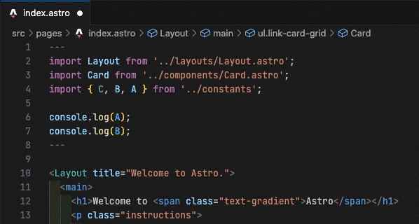

# [Prettier](https://prettier.io/) Plugin: Organize Imports for [Astro](https://astro.build/)

[](https://github.com/neoki07/prettier-plugin-astro-organize-imports/blob/main/LICENSE)
[](https://www.npmjs.com/package/prettier-plugin-astro-organize-imports)
[](https://www.npmjs.com/package/prettier-plugin-astro-organize-imports)
[](https://github.com/neoki07/prettier-plugin-astro-organize-imports/actions/workflows/ci.yml)

A plugin that makes Prettier organize your imports (i. e. sorts, combines and removes unused ones) in Astro files using the `organizeImports` feature of the TypeScript language service API.

<p align="center">
  
</p>

## Installation

```shell
npm install -D prettier prettier-plugin-astro-organize-imports
```

### Recommended configuration

<!-- prettier-ignore -->
```json5
// .prettierrc
{
  "plugins": ["prettier-plugin-astro-organize-imports"],
  "overrides": [
    {
      "files": "*.astro",
      "options": {
        "parser": "astro"
      }
    }
  ]
}
```

<!-- prettier-ignore-end -->

## Usage

After following the steps in the 'Installation' section, the plugin will function when you run the Prettier formatting command.

Files containing the substring `// organize-imports-ignore` or `// tslint:disable:ordered-imports` will be skipped and won't be processed by this plugin.

The plugin provides an option named `astroOrganizeImportsMode` that lets you choose the mode of formatting. The available options are:

- `All`: This is the default option. It removes unused imports, coalesces imports from the same module, and sorts imports.
- `SortAndCombine`: This option coalesces imports from the same module and sorts imports.
- `RemoveUnused`: This option removes the unused imports.

You can specify the mode in your Prettier configuration file as follows:

<!-- prettier-ignore -->
```json5
// .prettierrc
{
  // ..
  "astroOrganizeImportsMode": "All" // or "SortAndCombine" or "RemoveUnused"
}
```

<!-- prettier-ignore-end -->

Remember to replace "All" with "SortAndCombine" or "RemoveUnused" depending on your preferences.

## Compatibility with other Prettier plugins

This plugin uses Prettier APIs that can only be used by one plugin at a time, making it incompatible with other Prettier plugins implemented the same way. To solve this we've added explicit per-plugin workarounds that enable compatibility with the following Prettier plugins:

- `prettier-plugin-astro`
- `prettier-plugin-tailwindcss`

One limitation with this approach is that `prettier-plugin-astro-organize-imports` must be loaded last. You can do this by listing each of your Prettier plugins in the `plugins` array:

<!-- prettier-ignore -->
```json5
// .prettierrc
{
  // ..
  "plugins": [
    "prettier-plugin-astro",
    "prettier-plugin-tailwindcss",
    "prettier-plugin-astro-organize-imports" // MUST come last
  ],
  "overrides": [
    {
      "files": "*.astro",
      "options": {
        "parser": "astro"
      }
    }
  ]
}
```

<!-- prettier-ignore-end -->

## Related Prettier plugins

This plugin is heavily inspired by following plugins:

- [prettier-plugin-organize-imports](https://github.com/simonhaenisch/prettier-plugin-organize-imports)

And, for implementation reference, the following plugins:

- [prettier-plugin-astro](https://github.com/withastro/prettier-plugin-astro)
- [prettier-plugin-tailwindcss](https://github.com/tailwindlabs/prettier-plugin-tailwindcss)
